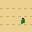
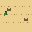
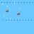

# BattleBlitz · 战棋

> 类似《火焰纹章》和《高级战争》风格的回合制战棋游戏。
> 后端：Python + FastAPI + SQLAlchemy（异步）+ SQLite
> 前端：原生 HTML / CSS / JS，由 FastAPI 静态托管

---

## ✨ 核心特性

- **15×15 棋盘**：随机生成 + 多种手绘地图预设（经典 / 开阔 / 山地 / 河流 / 森林 / 四方水泽）
- **5 个兵种 × 多种阵营组合**：经典 / 进攻 / 防御 / 远程火力 / 自定义阵容
- **物理 + 魔法双重战斗体系**：剑士 / 骑士 / 弓手（物理）vs 术士 / 治疗师（魔法），数值天生相克
- **MP 移动点系统**：每回合按地形消耗 MP，可移动攻击 / 攻击后移动（仅骑弓）
- **士气系统**：每杀一人 +1 士气（最高 3 星），按星加成攻击/防御
- **反击系统**：被攻击方若存活且能打到攻击者 → 自动反击（50% 伤害，火纹式，伤害类型随反击方）
- **战斗预测面板**：攻击前显示预测伤害 / 暴击率 / 反击伤害 / 兵种克制
- **AI 对手**：5 档难度 + 多种人格，所有 AI 可自动连续行动
- **存档与重连**：localStorage 保留 session，自动恢复大厅 / 棋盘
- **房间与好友**：2-4 人局域网联机，加入 AI 电脑填补空位
- **回合横幅**：回合切换时滑入动画提示
- **悬浮路径预览**：移动时鼠标悬浮显示 A* 寻路绿点
- **自定义地图编辑器**：保存 / 加载 JSON 地图，可选地形 + 自定义初始单位布置

---

## 🚀 快速开始

### Windows / 开发机

```bash
cd game
python -m venv venv
source venv/Scripts/activate        # Git Bash
# venv\Scripts\Activate.ps1         # PowerShell
pip install -r requirements.txt
python -m uvicorn app.main:app --host 0.0.0.0 --port 8000 --reload
```

打开 <http://localhost:8000/> 即可进入游戏。

### Linux

```bash
cd game
python3 -m venv venv
source venv/bin/activate
pip install -r requirements.txt
python -m uvicorn app.main:app --host 0.0.0.0 --port 8000
```

部署后同局域网的朋友打开 `http://你的IP:8000/` 即可加入。

---

## 🎮 玩法规则

### 单位

| 单位 | 图标 | HP | ATK | DEF | MATK | MDEF | 射程 | 类型 | 移动 | 技能 | 备注 |
|------|------|----|----|-----|------|------|------|------|------|------|------|
| 剑士 | 剑 | 45 | 18 | 12 | 4 | 4 | 1 | 物理 | 5 MP | — | 均衡近战基准 |
| 弓手 | 弓 | 35 | 20 | 6 | 4 | 4 | 2 (min 1) | 物理 | 5 MP | 狙击 | 远程被动 +1 射程，不能贴脸 |
| 骑士 | 骑 | 55 | 22 | 8 | 4 | 4 | 1 | 物理 | 8 MP | 连击 | 高机动双击（每次 50% 伤害）|
| **术士** | 咒 | 45 | 8 | 10 | **22** | **12** | **2 (1–2)** | **魔法** | 8 MP | — | 剑士的魔法镜像版 |
| **治疗师** | 疗 | 40 | 5 | 9 | 8 | 12 | 2 (1–2) | 魔法 | 5 MP | 治愈 | 魔法后场支援 |

### 兵种相克（靠数值天生形成）

每个单位都属于**物理**或**魔法**阵营：

- **物理单位**：高 ATK + DEF，低 MATK + MDEF
- **魔法单位**：高 MATK + MDEF，低 ATK + DEF

伤害公式根据**攻击方**的类型选 stat pair：

| 攻击方 → 守方 | 公式 | 结果 |
|---|---|---|
| 物理 → 物理 | ATK vs DEF（双方都高）| 中伤 |
| 物理 → 魔法 | ATK vs 守方 DEF（低）| **高伤**（魔法单位物防弱）|
| 魔法 → 物理 | MATK vs 守方 MDEF（低）| **高伤**（物理单位魔防弱）|
| 魔法 → 魔法 | MATK vs MDEF（双方都高）| 中伤 |

**反击**：被攻击方若存活且能打到攻击方，自动反击，伤害类型跟随反击方自身的 `attack_kind`，伤害 50%。

### 地形

| 地形 | 移动消耗 | 防御加成 | 特殊 |
|------|---------|---------|------|
| 平地 | 1 | 0 | - |
| 森林 | 2 | +2 | 阻挡远程视线 |
| 山地 | 3 | +3 | 阻挡远程视线 |
| 河流 | 3 | 0 | 阻挡远程视线 |
| 城堡 | 1 | +5 | 占满所有城堡即胜利 |

地形加成同时作用于物防和魔防。

### 战斗公式

```
有效攻击 = X × (1 + 攻击方士气 × 0.10)        # X = ATK 或 MATK，看 attack_kind
有效防御 = (Y + 地形) × (1 + 防守方士气 × 0.05)  # Y = DEF 或 MDEF，看 attack_kind
伤害    = 有效攻击 × (有效攻击 / (有效攻击 + 有效防御)) × 兵种克制 × 暴击
```

- **暴击**：基础 5% + 每级 +1%，伤害 1.5 倍
- **兵种克制**：剑 → 骑 (+20%)，骑 → 弓 (+20%)
- **士气**：每颗星 +10% 攻击 / +5% 防御

### 回合流程

1. 当前玩家可移动 / 攻击 / 治疗 / 待机
2. 点「结束回合 →」切换到下一玩家
3. 所有玩家都结束后，AI 自动连续行动
4. 一整轮结算 → 进入下一回合

### 公平性规则

- 第一个玩家（座位 0）在**第一回合**只能操作 **1 个单位**
- 其他玩家，以及所有人后续回合，每回合需操作 **2 个单位**
- 每单位每回合只能移动一次，移动后仍可攻击

---

## 🎨 美术资产

### 地形图块（48×48 像素风）

所有地形图块位于 `game/app/web/assets/tiles/`，每张 48×48 像素 PNG。每种地形提供 2 个视觉变体（`_v0` / `_v1`），城堡系列额外支持 3 种生态主题（grass / desert / snow）。合计 **64 张**。

> 图块通过 `tools/gen_terrain_tiles.py` 批量生成。

#### 🏞️ 基础地形

<p align="center">
  
  
  &emsp;平原&emsp;&emsp;
  
  
  &emsp;沙漠&emsp;&emsp;
  
  
  &emsp;雪地
</p>

<p align="center">
  
  
  
  
  
  
  &emsp;森林（草地 / 沙漠 / 雪地）
</p>

<p align="center">
  
  
  &emsp;山地&emsp;&emsp;
  
  
  
  
  &emsp;河流（4 方向变体）
</p>

<p align="center">
  
  
  &emsp;道路&emsp;&emsp;
  
  
  &emsp;村庄&emsp;&emsp;
  
  
  &emsp;城门&emsp;&emsp;
  
  
  &emsp;兵营
</p>

#### 🏰 城堡系列（3 生态 × 7 部件 × 2 变体）

<p align="center">
  
  
  
  &emsp;城堡&emsp;&emsp;
  
  
  
  &emsp;地板
</p>

<p align="center">
  
  
  
  &emsp;墙壁&emsp;&emsp;
  
  
  
  &emsp;门&emsp;&emsp;
  
  
  
  &emsp;楼梯
</p>

<p align="center">
  
  
  
  &emsp;王座&emsp;&emsp;
  
  
  
  &emsp;宝库
</p>

### 角色立绘

<p align="center">
  
  &emsp;
  
</p>

> 立绘通过独立的 AI 生成管线产出，手动放置到 `assets/` 目录。

---

## 🗂️ 项目结构

```
BattleBlitz/
├── README.md
├── docs/                   # 项目文档（详见 docs/README.md）
│   ├── 架构.md              # 整体架构 + API 列表
│   ├── 路线.md              # S0/P0-P3 路线图 + 进度
│   ├── 阶段.md              # 分阶段开发方案
│   ├── 死代码.md            # 死代码扫描结果
│   ├── llm-agent/           # LLM Agent 子系统文档
│   └── superpowers/specs/   # 设计 spec 文档
├── game/
│   ├── app/
│   │   ├── main.py          # FastAPI 入口
│   │   ├── config.py        # 全部游戏常量
│   │   ├── database.py      # 异步引擎 + session + 自动迁移
│   │   ├── models.py        # ORM 模型
│   │   ├── schemas.py       # Pydantic 模型
│   │   ├── game_logic.py    # 地图 / 战斗 / 反击 / 士气
│   │   ├── utils.py         # 寻路 / 视线 / 距离
│   │   ├── events/          # 事件总线（pub/sub）
│   │   ├── llm/             # LLM 客户端抽象
│   │   ├── progression/     # 角色养成（未来）
│   │   ├── classes/units/   # 兵种类体系（剑士 / 弓手 / 骑士 / 术士 / 治疗师）
│   │   ├── agent/           # LLM Agent 对手系统
│   │   ├── protocol/        # WebSocket v1 协议
│   │   ├── logging_config.py # 日志规范
│   │   ├── web/             # 前端
│   │   │   ├── index.html
│   │   │   ├── style.css
│   │   │   ├── app.js
│   │   │   └── assets/tiles/ # 地形像素图（48×48）
│   │   └── routes/
│   │       ├── game.py       # /games, /join, /start, /state, /presets, /add-ai, /units
│   │       ├── actions.py    # /move, /attack, /skill, /wait
│   │       ├── turns.py      # /end-turn + 后台超时
│   │       ├── editor.py     # 自定义地图编辑器 API
│   │       └── mainline.py   # 主线剧情 API
│   ├── tests/               # pytest 测试
│   ├── conftest.py
│   ├── pytest.ini
│   ├── requirements.txt
│   ├── requirements-dev.txt
│   ├── requirements-agent.txt
│   ├── start.bat
│   └── stop.bat
├── tests/                   # Agent 测试
└── tools/                   # 实用工具（地形图生成等）
```

---

## 📡 API 端点（精选）

| 方法 | 路径 | 说明 |
|------|------|------|
| GET  | `/healthz` | 健康检查 |
| POST | `/games` | 创建游戏 `{name, max_players, map_preset, map_biome, unit_composition}` |
| GET  | `/games` | 列出所有游戏 |
| GET  | `/games/presets` | 列出地图和兵种组合预设 |
| GET  | `/games/units` | 列出所有兵种元数据（含 attack_kind / matk / mdef）|
| GET  | `/games/skills` | 列出所有技能 |
| POST | `/games/{id}/join` | 加入游戏 `{user_name, color?}` |
| POST | `/games/{id}/rejoin` | 断线重连 `{player_id}` |
| POST | `/games/{id}/add-ai` | 添加 AI 电脑 `{difficulty}` |
| DELETE | `/games/{id}/players/{pid}` | 移除玩家（仅开始前）|
| POST | `/games/{id}/start` | 开始游戏 |
| GET  | `/games/{id}/state` | 完整状态快照 |
| POST | `/games/{id}/move` | 移动单位 `{player_id, unit_id, to_x, to_y}` |
| POST | `/games/{id}/attack` | 攻击目标 `{player_id, attacker_id, target_id}` |
| POST | `/games/{id}/skill` | 释放技能 |
| POST | `/games/{id}/wait` | 待机 |
| POST | `/games/{id}/end-turn` | 结束回合 `{player_id}` |
| GET  | `/` | 跳转到游戏 UI |
| GET  | `/docs` | OpenAPI Swagger 文档 |

---

## 🛠️ 配置常量（`app/config.py`）

| 常量 | 默认值 | 含义 |
|------|--------|------|
| `MAP_SIZE` | 15 | 棋盘大小 |
| `MORALE_MAX` | 3 | 最高士气星数 |
| `MORALE_ATK_PER_STAR` | 0.10 | 每星 +10% 攻击 |
| `MORALE_DEF_PER_STAR` | 0.05 | 每星 +5% 防御 |
| `COUNTER_DAMAGE_MULT` | 0.5 | 反击伤害乘数（0.5 = 火纹 50%）|
| `BASE_CRIT_RATE` | 0.05 | 暴击基础概率 |
| `CRIT_PER_LEVEL` | 0.01 | 每级额外暴击概率 |
| `CRIT_MULTIPLIER` | 1.5 | 暴击伤害倍数 |
| `TYPE_ADVANTAGE` | 1.20 | 兵种克制倍率 |
| `TURN_TIMEOUT_HOURS` | 24 | 玩家超时自动跳过 |
| `AI_THINK_DELAY_SECONDS` | 1.2 | AI 行动间隔（人眼友好）|
| `ABANDONED_LOBBY_MINUTES` | 30 | 空房间多久后清理 |

---

## 🧪 测试

```bash
cd game
source venv/bin/activate        # Linux
# source venv/Scripts/activate   # Git Bash on Windows
pytest tests/ -v
```

测试覆盖：
- 地图生成 / 寻路 / 视线
- 战斗公式（物理 / 魔法 / 士气 / 兵种克制 / 暴击）
- 反击触发条件 + 反击伤害类型跟随反击方
- API 端到端
- LLM Agent 决策

---

## 🐛 常见问题

**端口 8000 被占用**
```bash
# Windows
netstat -ano | findstr ":8000"
taskkill /F /PID <pid>
# Linux
lsof -i :8000
kill -9 <pid>
```

**数据库结构变了导致 `no such column` 错误**
```bash
rm game/battleblitz.db   # 重启会自动建新表 + 自动迁移
```

系统会自动跑 `_run_legacy_migrations` 给老存档加新列（`map_biome` / `phase` / `matk` / `mdef`），无需手动操作。

**Pydantic aarch64 安装失败**
`pydantic==2.10.3` 已锁定兼容 aarch64 wheels。

---

## 📜 许可

MIT