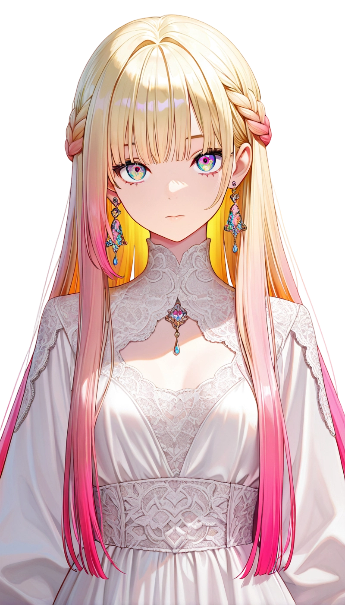
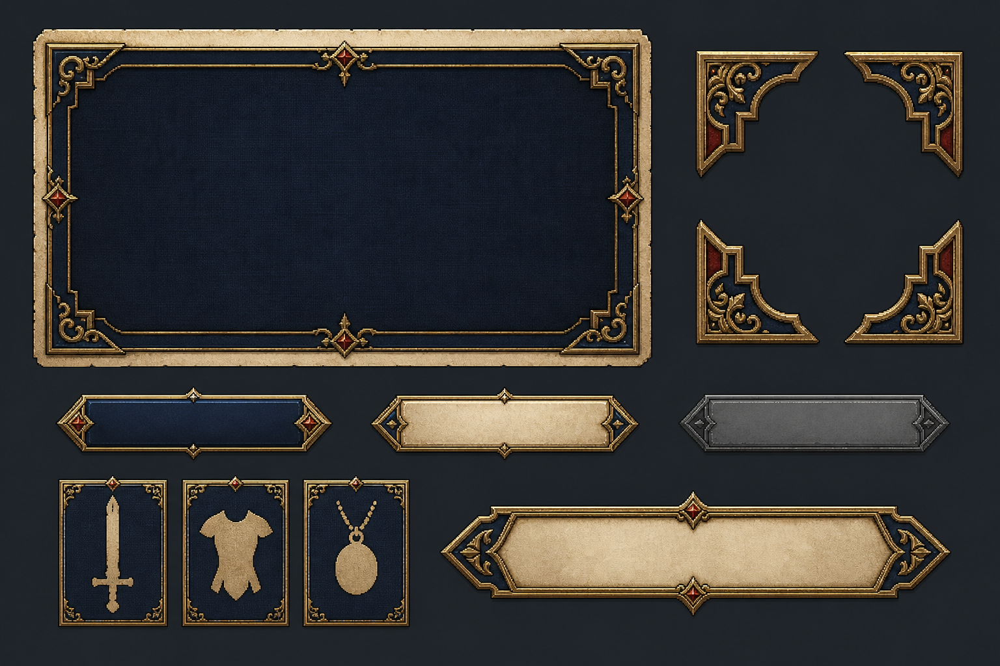

# Godot 主线与装备界面美术改造方案

日期：2026-07-28  
状态：待审核，未开始 UI 实现  
2026-07-28 修订：采用“控件皮肤优先”，先完成美观且可运行的框架，再补正式位图资产。

## 1. 目标与边界

目标是在不改动主线、英雄、装备与存档规则的前提下，把 Godot 客户端的主线选择、战前整备和装备操作，从当前的“列表 + 下拉框 + 文本说明”升级为具有原创日式战棋 RPG 气质的界面。

视觉方向借鉴的是“章节卷轴、羊皮纸情报页、深色战术面板、金属描边、肖像驱动的部队管理”这些设计语言，**不复制火焰纹章的原画、纹章、UI 图样或字体**。

本期范围：

- Godot 主线章节页、战前整备页、英雄详情页、装备页。
- 现有英雄肖像、纹章、职业立绘、像素地形的复用。
- 原创 UI 边框、槽位图标、章节横幅与交互状态。
- 既有 `/mainlines/*`、`/prepare`、`/prepare/equipment` 接口的数据绑定。

本期不做：

- 后端主线规则、装备数值、存档结构改造。
- Web UI 重做。
- 战斗棋盘、对话演出或地图美术的大规模改版。
- 直接使用任何外部火焰纹章素材。

## 2. 现状审计

当前 Godot 主线 UI 已有完整功能：章节列表、英雄/部队/装备/佣兵/商店/存档标签、指挥官选择、准备完成、开战、放弃主线。

主要问题不在功能缺失，而在呈现结构：

- `MainlineView/MLFrame` 以固定坐标的 `ColorRect` 和 `ReferenceRect` 构成，缺少可复用主题与层次。
- 整备内容集中输出到一个 `RichTextLabel`；英雄肖像、装备槽、属性变化和物品归属无法被快速扫描。
- 英雄与物品通过 `OptionButton` 选择，缺少“角色卡 / 装备栏 / 背包格”的战棋 RPG 反馈。
- 当前没有装备图标、章节横幅、九宫格边框和 UI 状态图，因此仅改色不能达到目标。

涉及代码的当前入口：

- `godot-client/scenes/main.tscn`：`MainlineView` 的场景节点。
- `godot-client/scripts/main.gd`：`_render_mainline_prepare()` 及各标签的文本构建函数。
- `godot-client/scripts/autoload/network_client.gd`：现有主线与装备 API，无需新增接口。

## 3. 可复用美术资产

以下资产已存在于 Godot 项目中，可直接进入新界面。

### 3.1 英雄肖像与纹章

   

| 资产 | 文件 | 原始尺寸 | 规划用途 |
|---|---|---:|---|
| 云肖像 | `godot-client/assets/heroes/portrait_yun.png` | 399 x 699 | 整备页焦点英雄立绘、角色卡 |
| 安娜肖像 | `godot-client/assets/heroes/portrait_anna.png` | 949 x 1658 | 整备页焦点英雄立绘、角色卡 |
| 安娜 Boss 肖像 | `godot-client/assets/heroes/portrait_anna_boss.png` | 774 x 1355 | 敌方章节情报与 Boss 预览，不用于玩家装备页 |
| 云纹章 | `godot-client/assets/heroes/crest_yun.png` | 120 x 120 | 英雄名册选中章、指挥官标识 |
| 安娜纹章 | `godot-client/assets/heroes/crest_anna.png` | 120 x 120 | 英雄名册选中章、指挥官标识 |

使用原则：肖像置于裁切后的纵向肖像窗中，保持完整人物比例；纹章只作为小型识别物，不拉伸成背景纹理。

### 3.2 职业立绘

| 职业 | 文件 | 原始尺寸 | 规划用途 |
|---|---|---:|---|
| 剑士 | `assets/classic/swordsman.png` | 210 x 271 | 部队名册、佣兵类型卡 |
| 弓手 | `assets/classic/archer.png` | 223 x 288 | 部队名册、佣兵类型卡 |
| 治疗师 | `assets/classic/healer.png` | 211 x 304 | 部队名册、佣兵类型卡 |
| 骑士 | `assets/classic/knight.png` | 281 x 303 | 部队名册、佣兵类型卡 |
| 术士 | `assets/classic/warlock.png` | 222 x 301 | 部队名册、英雄职业辅助图 |
| 重甲 | `assets/classic/heavy_armor.png` | 252 x 296 | 部队名册、佣兵类型卡 |

这些是透明背景职业立绘，适合裁成 72–112 px 高的卡片主体；不应用作装备图标或 UI 按钮底图。

### 3.3 地图与环境资产

项目已有草地、沙漠、雪地的平原/森林/山地，以及城堡、城门、王座、兵营、村庄等像素瓦片。主线界面可从中复用低透明度的城堡/地形拼贴作为章节卡背景，但不能把可读信息压在高对比地形上。

建议优先使用：

- `assets/tiles/castle_grass_v0.png`：主线标题区的淡背景。
- `assets/tiles/castle_throne_grass_v0.png`：已完成章节的王座印记。
- `assets/tiles/barracks_v0.png`：佣兵标签的识别图。
- `assets/tiles/plain_v0.png`、`forest_grass_v0.png`：低对比章节背景拼贴。

## 4. 缺失资产与制作规范

| 资产 | 是否阻塞第一版 | 原创规范 | 建议规格 | 使用位置 |
|---|---|---|---|---|
| 可拉伸面板边框 | 是 | 深蓝木纹/羊皮纸内衬/暗金铆钉，不使用外部 UI 图样 | 24 px 九宫格 | 所有主线与装备面板 |
| 章节横幅 | 是 | 原创织物旗帜，支持深蓝、暗红、灰金三种状态 | 640 x 112 | 章节详情、准备页标题 |
| 装备槽图标 | 是 | 原创剑、甲、坠饰轮廓；单色像素风 | 48 x 48 | 武器/防具/饰品槽 |
| 属性图标 | 否 | 心、剑、盾、法杖、靴子等通用原创符号 | 24 x 24 | 属性比较与提示 |
| 背包物品图标 | 是 | 每件装备至少一枚原创图标 | 48 x 48 | 背包格与已装备槽 |
| 章节场景插图 | 否 | 可用抽象战场、城墙、旌旗，不画外部 IP 人物 | 1280 x 360 | 章节横幅背景 |
| UI 音效 | 否 | 轻短的纸页、金属确认、装备落位音 | 0.1–0.4 秒 | 标签、装备、开战反馈 |

第一阶段可以先用程序化 `StyleBoxFlat`、现有肖像和临时单色槽位符号搭出结构；装备图标与九宫格边框必须在正式视觉验收前补齐。

## 4.1 优先级调整：控件皮肤先行

先美化框架，而不是等待所有插画完成。第一可运行版本使用 Godot 原生主题资源，保证适配缩放、可读性和交互状态；正式位图边框只作为后续替换，不改变节点结构。

第一版必须完成的皮肤资产和状态：

| 控件 | 第一版实现 | 正式替换目标 | 状态要求 |
|---|---|---|---|
| 主线框架 | `StyleBoxFlat` 深蓝外框、羊皮纸内面、暗金描边 | 24 px 原创九宫格边框 | 默认、聚焦、禁用 |
| 章节卡 | 深色战旗标题条 + 纸页正文 | 章节横幅与蜡封图 | 锁定、可继续、已完成、选中 |
| 主操作按钮 | 暗金填充、浅色文字、红色危险按钮 | 金属/木纹按钮图 | 默认、悬停、按下、禁用 |
| 装备槽 | 统一 72 px 槽位卡，先用 Unicode/绘制符号 | 剑/甲/坠饰原创图标 | 空、可装备、已装备、锁定 |
| 背包格 | 56 px 网格、库存角标、稀有度色条 | 48 px 原创物品图标 | 可选、已占用、不可用、选中 |
| 属性比较 | 原生 Label + 绿/红/灰色 Token | 可选的 24 px 属性图标 | 提升、下降、无变化 |

要求：第一版不依赖图像生成的文字准确性；所有中文标题、属性和按钮仍由 Godot `Label` 渲染。生成的边框和按钮不得内嵌不可编辑文字。

### 4.2 原创 UI 皮肤参考板 v1



文件：`docs/规划/主线/assets/mainline-ui-skin-reference-v1.png`（1536 x 1024）。

这是一张原创概念参考板，包含深海军蓝主面板、羊皮纸外框、暗金角饰、绯红菱形点缀、三类按钮态、武器/护甲/饰品槽位卡和无文字章节横幅。它用于审核色彩、材质与层级方向，**不是可直接投入 Godot 的成品贴图**：

- 大面板必须按九宫格重新绘制或切片，不能直接缩放整张概念板。
- 文字继续使用 Godot 原生控件，避免把中文烘焙进位图。
- 装备槽的剑、甲、饰品只作为图形语言参考；最终须拆为独立原创图标。
- 正式资产完成前，第一版仍采用 `StyleBoxFlat`，保持界面在不同窗口尺寸下可伸缩。

## 5. 目标界面设计

### 5.1 主线章节选择：战争档案桌

布局采用三栏：

1. 左栏为章节纵向卷轴卡：章节编号、标题、进度、战斗数、锁定/完成状态。
2. 中栏为选中章节的横幅、剧情摘要、地图地形拼贴和下一场战斗目标。
3. 右栏为“出征情报”：队伍英雄、推荐等级、指挥官、自动存档与主按钮。

交互状态：未解锁为压暗羊皮纸和蜡封；可继续章节以金色纹章强调；已完成章节使用低饱和王座印记。主操作永远只有一个高对比按钮：`继续整备` 或 `开始本战`。

### 5.2 战前整备：军议桌

顶部保留章节横幅和第几战信息；主体改为真实卡片而非一整块文本：

1. 左侧英雄名册：肖像缩略图、纹章、等级、生命条、装备数量。
2. 中央焦点英雄：大肖像、职业、等级/经验、六项属性、技能、转职状态。
3. 右侧任务摘要：胜利条件、敌方预览、地图缩略图、指挥官和资金。
4. 底部固定行动条：返回章节、保存/刷新、开始战斗。危险操作“放弃主线”与主按钮物理隔离。

标签页可保留，但不再把每个标签塞入同一个 `RichTextLabel`；每个标签应有自己的 `Control` 容器与可点击内容。

### 5.3 装备页：角色卡与背包

装备页在整备页内切换，布局固定为：

1. 左栏：英雄肖像与当前属性。
2. 中栏：武器、防具、饰品三枚槽位卡；已装备物品显示图标、名称和加成。
3. 右栏：背包网格，显示库存数量、已被其他英雄占用状态和可装备状态。
4. 底部：装备前后属性对比，例如 `HP 50 -> 53`，上升绿色、下降红色、无变化灰色。

操作规则沿用现有后端：装备立即保存；唯一库存被其他英雄占用时禁用；卸下操作明确作用于当前槽位；保存成功后重新请求准备数据并刷新三个槽位和背包。

## 6. 技术实施拆分

### 阶段 A：控件皮肤与视觉 Token（优先）

- 新增 `godot-client/themes/mainline_fe_theme.tres`，先统一深蓝、羊皮纸、暗金、危险红和属性增减色。
- 新增可复用 `PanelContainer`、`Button`、装备槽和背包格的 StyleBox 资源；先以代码/主题实现，不等待位图资产。
- 在现有 `MainlineView` 上先替换框架、标签、按钮和选择状态，确认 1280 x 720 可读性。
- 用截图审阅色板、间距、层级和按钮状态后，再冻结 Token。

### 阶段 B：主线与装备面板结构

- 新增 `godot-client/scenes/ui/mainline_prepare_panel.tscn`，替代 `MainlineView` 中固定坐标的大段整备节点。
- 新增 `godot-client/scripts/ui/mainline_prepare_panel.gd`，从 `main.gd` 拆出渲染、选择、属性比较与按钮状态。
- `main.gd` 只保留路由、网络回调和面板输入输出，不再拼接整备大段文本。

### 阶段 C：主线章节与军议桌

- 章节卡、章节横幅、任务摘要、英雄名册卡。
- 绑定现有章节列表、准备数据、指挥官和存档数据。
- 不改变任何 API 请求格式。

### 阶段 D：装备交互

- 三槽装备卡、库存格、物品提示、唯一库存禁用、属性比较。
- 调用既有 `prepare/equipment` API 后以新数据重绘。
- 复用后端已经保证的库存和槽位校验，客户端只做可视化预防。

### 阶段 E：原创美术与细节

- 替换临时 StyleBox 为原创九宫格边框、横幅、装备与属性图标。
- 加入轻量淡入、选中章和装备落位动画；不做干扰战棋操作的循环特效。
- 统一 1280 x 720 基线，并验证 16:10 与窄窗口的容器收缩行为。

## 7. 验收标准

- 主线、英雄、装备、佣兵、商店和存档仍可完整操作，主线开战流程不回归。
- 不再使用 `RichTextLabel` 作为装备和英雄详情的唯一交互承载。
- 装备后装备槽、背包库存、英雄装备数量和属性预览全部即时一致。
- 已被其他英雄占用的唯一装备不可点击，后端不再因正常 UI 操作收到重复 `409` 请求。
- Godot `smoke_test.gd` 覆盖新节点存在、装备/卸下回调、属性比较和主线开始按钮。
- 增加三张固定截图：章节列表、战前整备、装备页；由人工确认“原创战棋 RPG 气质”而非外部 IP 复刻。

## 8. 分支与提交策略

在开始前先同步远端主线内容，再建立独立分支：

```bash
git switch master
git pull --ff-only origin master
git switch -c feat/godot-mainline-fe-ui origin/master
```

建议提交边界：

1. `style(godot-ui): establish mainline tactical rpg control skin`
2. `refactor(godot-ui): extract mainline preparation panel`
3. `feat(godot-ui): add chapter chronicle and war-council layout`
4. `feat(godot-ui): add equipment slots inventory and stat preview`
5. `style(godot-ui): add original tactical rpg panel assets`
6. `test(godot-ui): cover mainline preparation visual interactions`

## 9. 待审核决策

1. 是否接受“原创战棋 RPG 风格”而非复刻火焰纹章具体 UI？建议接受。
2. 第一版是否允许使用程序化边框和单色临时图标，待结构稳定后再生成正式资产？建议允许。
3. 是否优先做主线/装备页，暂不美化佣兵、商店、存档标签？建议优先，后者沿用同一主题后续补齐。
4. 是否确认按第 8 节从同步后的 `origin/master` 新建功能分支？建议确认。
